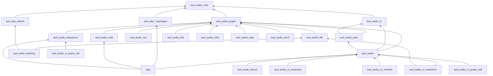

# 17: Audanika Audio Engine

Status: done 2026-10-08. The plan is reviewed and published; the
implementation steps S00 to S31 run as their own tickets.

## Goal

Give Audanika an audio engine that runs on every platform Flutter
supports — iOS, Android, macOS, Linux, Windows and Web — as an
ecosystem of Dart packages modeled on AudioKit: a signal-flow graph
defined in Dart and processed in C++, multi-channel audio IO, DSP
packages that plug into the graph, a sequencer, Ableton Link, UI
editors, plugin shells and a documentation site. This ticket delivers
the concept, the decisions and the split into implementation tickets;
it serves the quarter goal
[flutter-audio-kit](../goals/flutter-audio-kit.md). The requirements
are listed as R1 to R28 in
[requirements.md](../concepts/topics/requirements.md).

## Delivery order

Four milestones, all on iOS and Android (release-003):

- M1, the sampler: the Audanika app plays its instruments through
  `aud_dsp_sampler` on the new engine — S00 (all repos), S0-mobile, S1,
  S2, S3, S4, S8, S9, a minimal S22 and S24, S29a
  (release-002).
- M2, reverb and delay: the first effects ticket S10a and the app
  migration S29b.
- M3, AUv3 on iOS: `aud_audio_auv3` (S20) over the headless host, so
  the instruments run inside AUv3 hosts.
- M4, the backing player with time stretching: `aud_audio_file` (S23),
  `aud_dsp_stretch` (S30), `aud_audio_backing` (S31).

Everything else follows M4 and is planned, not promised.

## Affected repos

- `aud_audio_pm` — this plan, the topics, the decisions and the
  architecture. The only repo of ticket 17.
- Repos created by the implementation tickets, all in the GitHub
  organization `audaudio` (see "Package family").

## Concept in short

- **Naming.** Every public class carries the prefix `Aud` in Dart and
  C++ (`AudEngine`, `AudGraph`, `AudNode`), C symbols `aud_`; this plan
  omits the prefix for brevity (naming-001).
- **Dart defines, C++ renders.** The graph model, the parameters and
  the events are Dart objects; every edit compiles into a render
  program that the C++ engine adopts at the next block boundary. Dart
  never runs on the audio thread. The transport between them is
  `dart:ffi` natively and `dart:js_interop` on the web (interop-001,
  web-001).
- **Typed ports, sample-accurate events, OSC addresses.** Audio buses,
  event ports for MIDI, UMP and control messages, ramped parameters;
  every node, port and parameter has an OSC 1.1 address and the same
  message model serves API, command queue, sequencer and network; blocks
  are variable with sample-accurate events (graph-001, graph-002,
  osc-001).
- **Serial first, parallel where measured.** The render program is a
  DAG; rendering starts single-threaded and switches to coarse
  work-stealing jobs with deterministic summation when the program's
  cost justifies it (sched-001). Node instances keep their state across
  graph transactions, which the engine acknowledges by revision
  (graph-003); queues have capacities and overflow rules
  (interop-002).
- **DSP packages are Dart packages with C or C++ nodes.** Signal
  processing happens only in C or C++, compiled by build hooks per
  platform and linked into one WebAssembly module on the web; Dart holds
  descriptors, parameters and presets; the C ABI of `aud_audio_core` is
  the contract (interop-001).
- **Audio IO** through miniaudio's device layer on the desktop and
  Apple platforms, Oboe on Android, native escape hatches and an own
  AudioWorklet host (io-001, io-002).
- **Content**: sfizz as the sampler, the AudioKit family, STK, Freeverb,
  Signalsmith and chowdsp as effect sources — Dunne's Chorus, Flanger,
  StereoDelay and TransientShaper by name —, Rhino and DynaRage as the
  amp, Dunne's Synth as the first synthesizer instrument — only with
  clear provenance (sampler-001, dsp-001).
- **Host time is the clock.** Streams deliver presentation timestamps
  and latencies, the transport is a per-block snapshot behind the C ABI,
  and the internal clock, Ableton Link and plugin hosts share the same
  conversions (time-001).
- **Sequencer on the render thread**, synchronized through a `Transport`
  that Ableton Link implements in a separately licensed package, with
  quantized launches and start/stop sync (seq-001, link-001).
- **Backing player** (backing-001, milestone M4): a multitrack player
  with loops and pitch-preserving tempo changes on `aud_dsp_stretch` and
  `aud_audio_file`.
- **Extensions** (scope-001): analysis taps, spatial audio, Mutable
  Instruments ports, a waveform view, a benchmark app, recording and
  offline bounce.
- **Plugin shells** VST3, CLAP, AUv3 with the engine inside and Dart out
  of process (plugin-001); **UI packages** as Flutter widgets over models
  ported from Flow and PianoRoll (ui-001) plus controls and keyboard
  after AudioKit Controls and Keyboard (ui-002); **docs** on
  `audaudio.github.io`, built with Astro and Starlight after
  rljson.github.io, with tested Dart snippets (docs-001).

The target picture is in
[architecture.md](../architecture/architecture.md).

## Package family

| Package | Platforms | Contents | Native code | Depends on |
| --- | --- | --- | --- | --- |
| `aud_audio_core` | all | C ABI (node vtable, buffers, events, descriptors), C++ utilities (ring buffers, atomics, ramps), Dart contracts (node descriptors, ports, parameters, OSC message model, `Transport`), notices tooling | C headers, C++ | `aud_midi_standard` for MIDI 1.0 and UMP types (midi-001) |
| `aud_audio_graph` | all | C++ graph engine (programs, scheduler, workers, taps), Dart graph API (`Graph`, `Node`, `Param`, `Route`), offline renderer, fake IO for tests | C++ via hooks | core |
| `aud_audio_io` | all | device enumeration, hot-plug, duplex multi-channel streams with timestamps; miniaudio backend (macOS, iOS, Windows, Linux), Oboe backend (Android), AUHAL and IAudioClient3 backends, web worklet host | C/C++ via hooks | core |
| `aud_audio_web` | web | Emscripten toolchain, JS glue, worklet processor, build step that links the app's DSP packages into one module, fallback path | C++ to Wasm | graph, io |
| `aud_audio` | all | `Engine` = io + graph + node registry, conditional imports (ffi / js_interop), example and cookbook app | none | graph, io, web, core |
| `aud_audio_midi` | all | `aud_midi` ports as event inlets and outlets; MIDI 1.0 and UMP mapping | none | graph, `aud_midi` |
| `aud_audio_osc` | all | OSC 1.1 codec, address router, pattern matching, replies and notifications, optional UDP and WebSocket server | optional (tinyosc) | graph |
| `aud_audio_sequencer` | all | render-thread sequencer: tracks, clips, events, loops, transport commands; Dart model `Sequence`, `Track`, `Clip`, `Event` | C++ via hooks | graph |
| `aud_audio_link` | macOS, Windows, Linux, Android, iOS | transport provider on Ableton Link / LinkKit, multicast lock shim, settings UI; fetches Link and LinkKit at build time, app publishers need their own Ableton license | C++ (Link), LinkKit, JNI shim | graph |
| `aud_dsp_sampler` | all | SFZ sampler node on the sfizz fork, dr_libs loaders, message API on routes | C++ via hooks | core |
| `aud_dsp_effects` | all | oscillators, filters, delays, dynamics, modulation, distortion, reverbs, analysis taps | C++ via hooks | core |
| `aud_dsp_stk` | all | STK physical models (clarinet, flute, mandolin, Rhodes, shakers, bells and more) | C++ via hooks | core |
| `aud_dsp_guitar_amp` | all | Rhino amp head and cabinet, DynaRage compressor | C++ via hooks | core |
| `aud_dsp_synth` | all | polyphonic subtractive synthesizer ported from DunneAudioKit's Synth: wave-stack oscillators, filters, envelopes, sustain pedal; the first instrument node | C++ via hooks | core |
| `aud_dsp_analysis` | all | amplitude, FFT and pitch taps, meters, scope and spectrum buffers for the UI; pitch tracking from the literature | C++ via hooks | core |
| `aud_dsp_spatial` | all | ambisonics encoding and decoding up to third order, binaural decoding with Resonance Audio's HRTF renderers, panners | C++ via hooks | core |
| `aud_dsp_mi` | all | Mutable Instruments STM32 ports under neutral names: macro oscillator, modal resonator, granular processor | C++ via hooks | core |
| `aud_audio_file` | all | decoders (dr_libs, WavPack, Vorbis, Opus), FLAC encoding, disk-streaming player node, recorder node, offline bounce | C via hooks | graph |
| `aud_dsp_stretch` | all | time stretch and pitch shift node on Signalsmith Stretch: continuous ratio, semitone shift, phase-coherent instances, latency reporting | C++ via hooks | core |
| `aud_audio_backing` | all | multitrack backing player: song document, stems streamed and stretched per stem or group, transport-driven read position, loop regions with crossfades, quantized start, stop and song switching, per-stem gain, mute and solo | none | file, `aud_dsp_stretch` |
| `aud_audio_ui_graph_edit` | all | node graph editor widget; patch model (nodes, typed ports, wires) ported from Flow; adapter to `Graph` | none | `aud_audio` |
| `aud_audio_ui_piano_roll` | all | piano roll widget; note model ported from PianoRoll; adapter to `Sequence` | none | sequencer |
| `aud_audio_ui_controls` | all | knobs, sliders, wheels, ribbon, joystick, XY pad on one single-value and one two-value control with geometry mappings, ported from AudioKit Controls; `ParamBinding` to graph parameters by OSC address | none | `aud_audio` |
| `aud_audio_ui_keyboard` | all | multi-touch keyboard with piano, isomorphic, guitar and vertical layouts, latching, externally activated keys and a monitor view, ported from AudioKit Keyboard; `NoteBinding` to event inlets and the sequencer | none | `aud_audio` |
| `aud_audio_ui_waveform` | all | waveform view after AudioKit Waveform: peaks computed off the UI thread, multi-resolution cache, zoom and selection | none | `aud_audio`, file |
| `aud_audio_bench` | all | benchmark app: loopback latency, CPU per node type, xruns per device; publishes its numbers to the docs site | none | `aud_audio` |
| `aud_audio_vst3` | Windows, Linux, macOS | VST3 shell over the headless host: graph document, stable parameter ids, MIDI, buses, state, latency, offline rendering | C++ (VST3 SDK, MIT) | graph |
| `aud_audio_clap` | Windows, Linux, macOS | CLAP shell with note expressions and the thread-pool extension | C++ (CLAP, MIT) | graph |
| `aud_audio_auv3` | iOS, macOS | AUv3 extension: `AUAudioUnit` subclass over the engine, native view | C++, Swift | graph |
| `audaudio.github.io` | — | documentation site on Astro and Starlight after rljson.github.io: landing page, guides, one page per package synced from the repos, tested Dart snippets, API docs of all packages under `/api/` | Node (Astro), Dart (snippet tests, `dart doc`) | all |
| `aud_audio_pm` | — | this project management repo | — | — |

Rules of the family (family-001, repos-001): one repo per package in
`audaudio`, all created up front and wired by git references with
`tag_pattern` until pub.dev, `dna_audanika` in every repo, shared major
version, released together per gg ticket, the umbrella pins exact
versions, apps depend on `aud_audio` plus the DSP packages they use.

## Steps (each a later gg ticket)

The steps are ordered by delivery (release-003): milestone M1 is the
sampler on iOS and Android, M2 adds reverb and delay, M3 the AUv3
extension on iOS, M4 the backing player with time stretching;
everything else follows M4. Step numbers
are stable labels and no longer read in sequence. A step names the
steps it depends on; steps without a dependency inside a milestone run
in parallel. Every step becomes a ticket numbered in `doc/issues.md` of
`aud_audio_pm` (process-003) and gets its own plan file in `tickets/`
before it starts. Sizes are rough estimates for one
experienced engineer — S up to one week, M two to three weeks, L four
to six weeks, XL more — made without knowing the team; they are
re-estimated when owners are named (open question 5). M1 adds up to
roughly 22 to 32 engineer-weeks.

### Milestone M1: the sampler on iOS and Android

- S00 (M, done 2026-10-08, ticket 2) Create the repos: every package of the family gets its repo
  in the `audaudio` organization before any implementation — created
  from the matching template (`dart create -t package`,
  `flutter create --template=package_ffi` for C and C++ through hooks,
  the Flutter package template for the UI packages, rljson.github.io
  for the docs site), with the `dna_audanika` layer, `index.jsonc`,
  README, CHANGELOG, the quick-check workflow and the GitHub ruleset.
  The pubspecs are wired to each other according to the package graph
  by git references with `tag_pattern` (repos-001); every repo gets an
  initial `0.0.1` tag in dependency order so the references resolve;
  `aud_audio_core` references `aud_midi_standard` the same way as soon
  as that repo exists; `gg do upgrade ocean` refreshes the workspace so
  later tickets add existing repos with `gg do add`. The switch to
  pub.dev versions is part of S22 once the packages are published.
  Depends on nothing.
- S0 Spikes, split into decision gates so that the mobile foundation
  waits for nothing else:
  - S0-mobile (M, gates M1, done 2026-10-08 on the simulator and the emulator, ticket 5; real devices open): (a) a C++ sine reaches the device on iOS
    and Android through a `package_ffi` hook build, controlled from
    Dart, with measured callback period and command latency; (d) the
    sfizz fork builds for iOS and Android (clang-19 fix) and a legacy
    preset plays sustained for ten minutes; (e) two separately built
    DSP packages register nodes through the C ABI into one engine; (f)
    the core packages install and test with the Dart SDK alone, no
    Flutter.
  - S0-desktop (S, gates S3b): (a) on macOS, Windows and Linux.
  - S0-web (M, gates S5): (b) an Emscripten Wasm Audio Worklet driven
    from Dart web (dart2js and dart2wasm) with and without cross-origin
    isolation, with a representative sampler workload, asset loading
    through the main thread (the worklet has no `fetch`) and sustained
    playback in the fallback; sfizz in Wasm (web-003).
  - S0-parallel (M, gates S6): (c) parallel block processing with
    workers joined to the audio workgroup / MMCSS / SCHED_FIFO / Android
    high priority, xrun counts, on representative Audanika workloads.
  - S0-link (S, gates S15): (g) Link alignment: the example joins a Link
    session with LinkHut on a second machine and a loopback recording of
    both clicks measures the alignment error per platform, with native
    timestamps and the miniaudio shim.
  - S0-plugin-ui (M, done 2026-10-09, ticket 24; gates the UI of S18 to
    S20, answers open question 1, planned in ticket 23): (h) a Flutter UI
    for a plugin shell. A
    minimal VST3 over the headless host opens a Flutter window in a
    separate process (as flutter_vst3 does), embeds it in the host's
    editor window on macOS (Windows follows in S18), and drives
    parameters and the graph document through `AudCommand` over a Unix
    domain socket, reusing `aud_audio_ui_controls` unchanged; the spike
    builds the first slice of S17a for it (`Control`, `ArcKnob`,
    `ParamBinding` over an abstract parameter sink). Measured: memory
    per instance, UI-to-audio parameter latency, two instances and two
    Flutter plugins in one REAPER process, editor open and close, the
    embedding also in Ableton Live. Compared against Flutter in process
    with a renamed framework and a native view. On iOS: Flutter in the
    AUv3 extension inside the 360 MB budget, with a ballast in place of
    the sampler; S20 repeats it with the sampler. Result: a decision
    record that settles plugin-001's open UI work for macOS and iOS.
    Depends on S2b; not on S4. Result: plugin-003 (proposed) — on macOS
    the editor is a Flutter app in a process of its own, shown through
    shared IOSurfaces with forwarded input, one process per DAW process
    and plugin build; on iOS Flutter runs in the AUv3 extension; Flutter
    inside the DAW process is rejected. ui-003 (proposed) moves the
    engine adapters of the UI packages into a binding package.
- S1 (L, done 2026-10-08, ticket 18) `aud_audio_core`: the versioned C ABI (abi-001: sized structs,
  capabilities, allocator ownership, thread-affinity tags, state
  serialization, latency and tail reporting), buffer and event formats,
  descriptors, Dart contracts, the typed command model with the OSC adapter
  over it (osc-001), the UMP event model with per-note controllers for MPE and
  MIDI 2.0, the node preset schema (JSON), the timing contract (time-001:
  three time domains with validity, the timestamp filter with its reset rules,
  transport segments and capabilities, provider vtable), the notices file
  convention and its check. Depends on S00, S0 and on the first release of
  `aud_midi_standard` (midi-001).
- S2 (XL, done 2026-10-08: the engine, the Dart API and the document in
  ticket 19; the headless host, the stress tests and the watchdog as S2b
  in ticket 20) `aud_audio_graph`: engine with
  typed ports, persistent node instances and immutable programs, graph
  transactions with revision
  acknowledgements, fades and retirement (graph-003), the realtime
  queues with their capacities and policies and the notification thread
  (interop-002), the engine lifecycle with the route-change sequence
  and resource budgets (lifecycle-001), program compiler, serial
  scheduler, parameter ramps, sub-block events, feedback nodes with
  delays in samples, latency alignment with the live and scheduled
  policies, taps; the graph document (JSON) that the editor, the presets
  and the plugin shells share; xrun and diagnostics counters as events;
  a debug watchdog for locks and allocations on the audio thread; Dart
  graph API; offline renderer with a virtual timeline and fake IO;
  golden-file tests and stress tests (queue overflow, late events, graph
  swaps under load, route changes); the reference nodes — test
  oscillator, gain, mixer, a simple filter — that tests, the example app
  and the benchmarks use before S10a exists; the headless host API with
  host-supplied buffers (plugin-002). Depends on S1.
- S3 (L, built 2026-10-09 in ticket 21 for iOS and Android; the numbers
  of the reference devices open) `aud_audio_io`: device model,
  enumeration, hot-plug, duplex
  streams with presentation timestamps and latency per direction —
  mobile first (release-001): the Oboe backend for Android (io-002,
  compiled in the build hook with 16 KB page alignment) and the
  miniaudio backend on iOS. The desktop backends follow as S3b
  (miniaudio on macOS, Windows and Linux), S3c (AUHAL, workgroups,
  aggregate devices) and S3d (IAudioClient3), each with native
  timestamps. Depends on S1.
- S4 (M, built 2026-10-09 in ticket 22 for iOS and Android: `AudEngine`,
  the registry, the split of core, graph and io into neutral and ffi
  parts; the Pixel numbers are open) `aud_audio` umbrella: `Engine`, node registry, conditional
  imports, example app on the reference nodes of S2 (oscillator →
  filter → output on iOS and Android, the desktop platforms as S3b
  lands), first `0.x` release of core, graph, io and umbrella with iOS
  and Android platform tags. Depends on S2, S3.
- S8 (M) `aud_audio_midi`: `aud_midi` input and output ports as event
  inlets and outlets, MIDI 1.0 and UMP mapping, keyboard-to-synth demo.
  Depends on S4 and on the `aud_midi` family, which is available; the
  minimal bridge release-002 held in reserve is not needed (2026-10-08).
- S22 (M) Tooling: starts small with S1 — analyze, format, tests and
  the notices check on every repo — and grows into the CI matrix (macOS,
  Windows, Linux runners, Android emulator, headless Chrome), Clang's
  RealtimeSanitizer and the watchdog in CI, a supply-chain repo like
  `aud_sc`. Depends on S1 (minimal), S4 (matrix).
- S24 (M) `aud_audio_bench`: starts small with S4 — callback time,
  xruns and command-to-sound latency on the reference devices — and
  grows into loopback latency measurement, CPU per node type and memory
  per device; results as JSON published on the docs site; its numbers
  gate the parallel scheduler's default (sched-001). Depends on S4
  (minimal), S22 (publishing).
- S9 (L) `aud_dsp_sampler`: sfizz node, loaders, SFZ presets as node
  presets, the message API on routes. No backward compatibility with the
  presets or the API of the existing Audanika app (scope-002). Depends on
  S4, S0d.
- S29a (M, M1) Early app integration: an integration branch of `aud_app`
  plays one SFZ instrument through `aud_audio` and `aud_dsp_sampler` from
  the app's MIDI stream on iOS and Android as soon as S4 and S9 exist,
  and feeds its findings back into the contracts. The code repo lives in
  `audanika-private`; the plan file lives here. Depends on S4, S9.

### Milestone M2: reverb and delay in the Audanika app

- S10a (M, M2) `aud_dsp_effects`, first ticket — reverb and delay: a
  Freeverb-based reverb (public domain) and a plate reverb re-implemented
  from the literature (dsp-001), DunneAudioKit's StereoDelay (MIT) and a
  tempo-synced delay. Depends on S4.
- S29b (L, M2) App migration: `aud_app` replaces the legacy
  `audio_engine` with `aud_audio`, `aud_audio_midi` over the `aud_midi`
  ports and `aud_dsp_sampler` with the reverb and
  delay of S10a; the instruments are rebuilt as SFZ and graph documents,
  the legacy presets are neither converted nor emulated (scope-002); the
  instrument reference suite of the new instruments passes on the
  reference devices (release-001, release-002). Depends on S29a, S10a.

### Milestone M3: AUv3 on iOS

- S20 (L, M3) `aud_audio_auv3`: the AUv3 extension over the headless
  host (plugin-002) with its host app on iOS: the sampler with its
  presets and assets loaded without Dart, stable parameter ids, state
  restoration, memory measurement with the sampler loaded (S0-plugin-ui
  measured Flutter's share with a ballast); the editor per plugin-003:
  Flutter in the extension, the engines of all instances from one
  `FlutterEngineGroup`, started when the view first appears, the
  widgets writing the parameter tree. Depends on S4, S9; not on S6.

### Milestone M4: the backing player with time stretching

- S23 (L) `aud_audio_file`: decoders (dr_libs for WAV, FLAC and MP3,
  WavPack, stb_vorbis or libvorbis, libopus), libFLAC encoding, platform
  decoders for AAC and ALAC later, a disk-streaming player node with a
  read-ahead worker and ring buffer, a recorder node, offline bounce of
  a graph to a file. Depends on S4.
- S30 (M) `aud_dsp_stretch`: the time-stretch and pitch-shift node on
  Signalsmith Stretch (MIT), continuous ratio and semitone shift,
  phase-coherent instances through a shared block configuration,
  latency reporting, golden renders against a pitch tracker. Depends on
  S4.
- S31 (L) `aud_audio_backing`: the song document, stem streaming through
  `aud_audio_file`, per-stem or per-group stretching, the
  transport-driven read position, loop regions with crossfades,
  quantized start, stop and song switching with the next song
  preloaded, per-stem gain, mute and solo, the Dart API
  (`AudBackingPlayer`, `AudSong`, `AudStem`, `AudLoopRegion`),
  acceptance tests of the verification section. Depends on S23, S30.

### After M4: platforms and engine

- S3b to S3d (M each): the desktop IO backends described in S3 —
  miniaudio on macOS, Windows and Linux; AUHAL with workgroups and
  aggregate devices; IAudioClient3. Gated by S0-desktop.
- S5 (L) `aud_audio_web`: Emscripten build, worklet processor, the Wasm
  Worker control runtime (web-002), JS glue, shared-memory ring buffers
  with the message fallback and its reduced guarantees, web example; the
  same example app runs in Chrome, Firefox and Safari. Depends on S4.
- S6 (L) Parallel scheduler in `aud_audio_graph`, opt-in: the cost model
  that switches it on, coarse jobs, work-stealing workers, platform
  priorities, deterministic summation, the late-worker guard, host pools
  in plugins; benchmark and jitter measurements decide the defaults.
  Depends on S4.
- S7 (M) `aud_audio_osc`: address router, pattern matching, replies and
  notifications, UDP and WebSocket server, service discovery and remote
  sessions; remote control of a running engine from another device,
  shown with the example app. Depends on S4.

### After M4: DSP content

- S10b (M) `aud_dsp_effects`, second ticket: oscillators, filters,
  dynamics (compressor, TransientShaper), modulation (Chorus, Flanger),
  distortion; provenance per dsp-001. Depends on S10a.
- S10c (M) `aud_dsp_analysis` as its own package: amplitude, FFT and
  pitch taps, meters, scope and spectrum buffers, pitch tracking from
  the literature (YIN, McLeod). Depends on S4.
- S11 (M) `aud_dsp_stk`: STK instruments as nodes. Depends on S4.
- S12 (M) `aud_dsp_guitar_amp`: Rhino and DynaRage after the provenance
  question is settled. Depends on S4.
- S13 (M) `aud_dsp_synth`: a polyphonic subtractive synthesizer instrument
  ported from DunneAudioKit's Synth — wave-stack oscillators with
  ensemble and drawbar modes, multi-stage and resonant filters, ADSR and
  AHDSHR envelopes, sustain pedal logic — as the first instrument node
  of the family, with presets and a cookbook page; the resonant filter
  adapted from an Apple code sample is re-implemented unless its license
  is confirmed. Depends on S4.

### After M4: sequencing and sync

- S14 (L) `aud_audio_sequencer`: render-thread sequencer, Dart model,
  loop and transport semantics, MIDI file import. Depends on S4 and the
  event types of S1; MIDI device integration (S8) is separate.
- S15 (M) `aud_audio_link`: transport provider on Link (desktop, Android
  with the multicast lock shim) and LinkKit (iOS, settings view,
  entitlement), start/stop sync, quantized launches, alignment test
  against LinkHut, Link Audio research, the build-time fetch of Link and
  LinkKit with the license notice for app publishers (link-002). Depends
  on S14.

### After M4: UI

- S16 (L) `aud_audio_ui_graph_edit`: patch model, canvas, wiring, node
  palette from the registry, adapter to `Graph`, a remote mode that
  edits a graph running on another device through `aud_audio_osc`.
  Depends on S4, S7.
- S17 (L) `aud_audio_ui_piano_roll`: note model, canvas, editing, adapter
  to `Sequence`. Depends on S14.
- S17a (M) `aud_audio_ui_controls`: the `Control` and `TwoParameterControl`
  primitives with their geometries and the pointer-averaging gesture
  layer, the eight implementations of AudioKit Controls, `ControlsTheme`,
  `ParamBinding` with parameter gestures, golden tests, cookbook page.
  Completes the slice S0-plugin-ui built (`aud_audio_ui_controls` 0.1.0:
  `Control`, `ArcKnob`, `ParamBinding` over an abstract parameter sink,
  the widgets free of the umbrella) and creates the binding package
  `aud_audio_ui_bindings` with the parameter sink over `AudEngine`
  (ui-003). Depends on S4.
- S17b (M) `aud_audio_ui_keyboard`: `Keyboard` with the five layouts,
  `KeyboardModel` with multi-touch, latching and external activation,
  `KeyboardKey`, `MidiMonitorKeyboard`, `NoteBinding` into event inlets
  and the sequencer, the music-theory choice of ui-002, golden tests,
  cookbook page with the sampler. Depends on S4, S9.
- S27 (M) `aud_audio_ui_waveform`: waveform view with peaks computed in an
  isolate, a multi-resolution cache, zoom and selection, rendering with
  CustomPainter or fragment shaders, model after AudioKit Waveform.
  Depends on S4, S23.

### After M4: plugin shells

- S18 (L) `aud_audio_vst3`: shell over the headless host (plugin-002)
  with the graph document, stable parameter ids and automation
  gestures, bus mapping, state restoration, latency and tail, offline
  rendering, note expressions from the per-note controllers (MPE,
  MIDI 2.0), the host transport as transport provider, validator run,
  test in REAPER on Windows and Linux; the editor per plugin-003 on
  macOS, growing from the spike's plugin and editor app (variant S), and
  on Windows and Linux decided here with the spike's measurements and
  scripts; parameters only until it is decided. Depends on S4 (serial
  engine), not on S6.
- S19 (M) `aud_audio_clap`: shell reusing S18's mapping and editor
  (plugin-003), note expressions from the per-note controllers, the
  thread-pool extension with its single-threaded fallback. Depends on
  S18.
### After M4: documentation, tooling and extensions

- S21 (M) `audaudio.github.io`: create the repo from rljson.github.io
  (Astro 7, Starlight 0.42, pnpm, DNA layers, quick check), Audanika
  theme and landing page, Dart snippet tests with regions and goldens on
  the offline renderer, the `sync-packages` script, `dart doc` over a
  synthetic umbrella into `/api/` in the deploy workflow, the ecosystem
  page; grows with every step. Depends on S4.
- S25 (L) `aud_dsp_spatial`: ambisonics encoding and decoding up to third
  order, binaural decoding with Resonance Audio's HRTF renderers
  (Apache-2.0, NOTICE), VBAP and stereo panners from the literature,
  head-tracking input as parameters. Depends on S4, S10a.
- S26 (M) `aud_dsp_mi`: the Mutable Instruments STM32 ports — macro
  oscillator, modal resonator, granular processor — under neutral node
  names with MIT notices and the trademark rule. Depends on S4.
- S28 (S) Faust pipeline for `aud_dsp_effects`: generate C++ from `.dsp`
  files that use only functions declared STK-4.3 or MIT, a license gate
  that reads every `declare license`, generated code checked in with
  notices; the LGPL compiler runs at development time only. Depends on
  S10a and on open question 3.

## Model and effort for the implementation

The implementation tickets are worked with Claude Code; model and
effort follow the class of the ticket (process-002):

| Ticket class | Model | Effort |
| --- | --- | --- |
| Real-time and cross-platform core: S0, S1, S2, S3, S6, S15, S18 to S20, provenance audits | Claude Fable 5.1 | max |
| Remaining C++ and FFI work; planning of implementation tickets; reviews of core code | Claude Fable 5.1 | high |
| Well-specified Dart work: S16, S17, S17a, S17b, S27, S21, DSP ports with a given source (S9 to S13, S25, S26, S30) | Claude Opus 5.5 | high |
| Mechanical work: bootstrap and DNA, READMEs and indexes, notices, CI configuration, test scaffolding | Claude Sonnet 5.5 | medium |
| Trivial edits and formatting | Claude Haiku 4.5 | low |

## Verification

- Every package: unit tests, `dart analyze`, format, the DNA test, and
  golden-file offline renders. Goldens are bit-exact on one target per
  CI job; across architectures a tolerance per node class applies
  (default: maximum absolute difference below 1e-5 full scale).
- Engine contracts: stress tests prove the queue policies (overflow,
  late events, note-off recovery), click-free graph transactions under
  load (a click detector on the golden renders), the route-change
  sequence, and the acknowledgement of revisions and lifecycle
  transitions.
- Budgets on the reference devices (open question 6; defaults below
  until named): 64 sampler voices at 48 kHz and 128-frame blocks with
  the callback at most 50 % of the block budget; an instrument loads
  in at most two seconds within the sample cache budget; command-to-
  sound latency at most one block plus the output latency; zero xruns
  over ten minutes of playing with UI animation and under thermal load
  after a twenty-minute warm-up at the default buffer size.
- Recovery: after each lifecycle case — interruption, route change,
  disconnect, sample-rate change — the engine resumes within 500 ms
  with the transport position preserved and no stuck notes.
- Platform proof per step: mobile first — iOS and Android gate M1 and
  the first releases (emulators in CI, real devices before a release);
  desktop and web join the gates as their tickets land; latency and
  xrun numbers are recorded in the benchmark pages.
- The instrument reference suite replaces "no audible difference": per
  instrument of the new app (scope-002), golden renders of envelopes at
  several velocities, velocity response, sustain pedal, modulation and
  voice stealing, compared within tolerance, plus a listening check on
  the reference devices.
- Provenance: the notices check passes in every repo; no file without
  a license entry.
- Link alignment: on the two reference devices and a Mac running
  LinkHut, wired output routes, loopback latency calibrated first, 100
  measurements per platform: median error at most 1 ms, 95th percentile
  at most 2 ms; the same measurement passes with the internal clock
  against a plugin host's transport.
- Benchmarks: `aud_audio_bench` publishes latency, CPU and xrun numbers
  per device with every release.
- Backing player: a tempo change from 80 to 120 BPM keeps every stem's
  pitch within five cents (pitch tracker on the golden render), the
  loop seam and the song switch are click-free, stems stay aligned
  within one millisecond, and eight stems play within the mobile
  budgets on the reference devices.

## Open questions

1. Plugin UI in v1: native view, Flutter in a separate process, or no
   UI (parameters only)? Answered for macOS and iOS by the spike
   S0-plugin-ui (ticket 24): plugin-003 (proposed), a Flutter editor out
   of process on macOS and in the extension on iOS. S18 answers it for
   Windows and Linux; until then the shells ship parameters only there.
2. Is `aud_audio_clap` wanted in the first round of plugin shells, or
   after VST3 and AUv3 ship?
3. Faust: is the LGPL Faust compiler acceptable as a development-time
   tool whose generated code (from STK-4.3 and MIT functions only) is
   checked in under MIT? Nothing of the compiler is shipped (S28); the
   question must be settled before S28 starts.
4. Musical transitions beyond quantized song switching — crossfades,
   fills, key changes between songs — wanted in `aud_audio_backing`
   (backing-001)?
5. Team and capacity: who implements, how many engineers, from when?
   The size estimates become a schedule and the steps get owners only
   with this answer.
6. Reference devices for the budgets: which iPhone and which Android
   device define the lower bound?

## Answered at plan review

2026-10-07:

- License of the packages: MIT for every package, Audanika as the
  copyright holder (license-002).
- LGPL: not used in any form; permissive alternatives or
  re-implementations instead (license-002, dsp-001, sampler-001).
- Pure-Dart DSP: none. Signal processing happens only in C or C++; a
  "Dart DSP package" bundles C or C++ node code with a Dart API
  (interop-001).
- Soundpipe: the Csound- and Zita-derived modules are never copied;
  their algorithms are re-implemented from the literature or replaced
  by permissive alternatives (dsp-001).

2026-10-08:

- Block model: variable blocks with sample-accurate events; a
  fixed-block adapter for nodes that need constant frame counts
  (graph-002).
- Documentation site: Astro and Starlight, created from
  rljson.github.io as the template (docs-001).
- UI packages `aud_audio_ui_controls` (after AudioKit Controls) and
  `aud_audio_ui_keyboard` (after AudioKit Keyboard) join the family
  (R29, R30, ui-002).
- DunneAudioKit: Chorus, Flanger, StereoDelay and TransientShaper are
  named nodes of `aud_dsp_effects`; `aud_dsp_synth` ports Dunne's Synth
  as the first instrument; sfizz stays the sampler and CoreSampler is
  deferred (R31, dsp-001, sampler-001).
- Android IO: Oboe directly as the backend; miniaudio serves macOS,
  iOS, Windows and Linux (io-002).
- MIDI types: `aud_audio_core` depends on `aud_midi_standard`; no
  interim event types (midi-001).
- Ableton Link license: Audanika holds none; `aud_audio_link` fetches
  Link and LinkKit at build time and tells app publishers to obtain
  their own license (link-002).
- Package name: the AUv3 shell is `aud_audio_auv3` (family-001).
- Platform order: mobile first — iOS and Android gate the first
  releases, desktop and web follow (release-001).
- Ticket IDs: GitHub issue numbers of `aud_audio_pm`, status on an
  organization Projects board; 17 stays the exception (process-001).
  Superseded on 2026-10-08: the numbers live in `doc/issues.md` of this
  repo, no GitHub issues (process-003).
- Further suggestions (R28): all planned — six new packages in phase 7,
  the cross-cutting ones folded into existing steps (scope-001).
- External review of the engine contracts: ten of eleven points
  accepted into graph-003, interop-002, abi-001, lifecycle-001, web-002
  and amendments of sched-001, time-001, osc-001, graph-001,
  family-001 and license-001; point 11 was already covered by link-002
  (topics/review-2026-10-08-engine-contracts.md).
- Second external review, scope and sequence: milestone M1 bounded
  (release-002), the web capability contract (web-003), the headless
  engine host (plugin-002), size estimates, split spike gates, S14 and
  S18 to S20 freed from their dependencies, S22, S24 and S29 started
  early, thresholds in the verification section; the musical
  requirements and the team are open questions 4 to 6
  (topics/review-2026-10-08-plan-scope.md).
- Naming: `Aud` is the prefix of all classes (R33, naming-001).
- Delivery order: sampler first, reverb and delay second, AUv3 third,
  the backing player with time stretching fourth, all on iOS and
  Android; the steps are regrouped by milestone (release-003).
- Repos: all created up front in S00 and wired by git references with
  `tag_pattern` (R35, repos-001).
- Model and effort per ticket class recorded (process-002).
- Backing tracks: a multitrack backing player with loops and tempo
  changes without pitch change is required (R34); planned as
  `aud_dsp_stretch` (S30) and `aud_audio_backing` (S31, backing-001);
  transitions beyond song switching stay open question 4.

## Suggestions taken into the plan (R28)

All suggestions were planned on 2026-10-08 (scope-001):

- `aud_audio_clap`: planned as S19; whether it joins the first round of
  shells is open question 2.
- `aud_dsp_analysis`: its own package, S10c.
- `aud_audio_file`: S23.
- `aud_audio_ui_waveform`: S27.
- `aud_dsp_mi`: S26.
- The Faust pipeline: S28, pending open question 3.
- `aud_dsp_spatial`: S25.
- MIDI 2.0 and MPE: per-note controllers in the core's UMP event model
  (S1) and note expressions in the plugin shells (S18, S19).
- Real-time safety tooling: the watchdog and the counters in S2, which
  also runs the native tests under RealtimeSanitizer and ThreadSanitizer
  where the machine has them (ticket 20); both in CI in S22.
- The benchmark app: `aud_audio_bench`, S24.
- Remote control: service discovery and remote sessions in S7, the
  remote mode of the graph editor in S16.
- Presets as JSON: the node preset schema in S1, the graph document in
  S2, SFZ for the sampler in S9.
- The Audanika app migration: S29.

## Sources

The research behind this plan is in `../concepts/topics`: requirements,
legacy engine, AudioKit and graph engines, audio IO per platform, Dart
interop and the web, plugin formats, licenses and DSP sources, sfizz,
Ableton Link, OSC, docs site. All sources were fetched on 2026-10-07.
