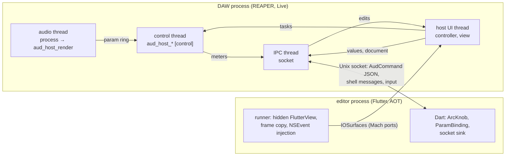

# 24: S0-plugin-ui — Spike a Flutter editor for the plugin shells on macOS and iOS

Status: in progress since 2026-10-09; plan review, implementation,
measurements in the test host, in REAPER and on the iPad, the code
review and the reruns after its fixes are done. Open: the embedding checklist by hand in REAPER and
Live, and the open and close cycles in Live (Gabriel Gatzsche).

## Goal

Build the spike S0-plugin-ui that ticket 23 planned
([2026-10-09-23-plan-the-spike-for-a-flutter-ui-in-plugin-shells.md](2026-10-09-23-plan-the-spike-for-a-flutter-ui-in-plugin-shells.md)).
It answers open question 1 of ticket 17 for macOS and iOS and the open UI
work of [plugin-001](../concepts/decisions/plugin-001.md): can the plugin
shells S18 to S20 carry an editor built from the family's Flutter UI
packages, embedded in the host's plugin window, without Dart in the DAW
process, and at what cost compared with a native view and the host's
generic view? The result is the decision record plugin-003 (proposed).
Serves [flutter-audio-kit](../goals/flutter-audio-kit.md).

## Decided before this ticket

From the plan review of ticket 23 (2026-10-09):

- Every measurement in REAPER; the embedding checklist and the open and
  close cycles in Ableton Live as well.
- macOS only; S18 decides Windows and Linux.
- IPC: a Unix domain socket carrying `AudCommand` as JSON; shared-memory
  rings only if the IPC misses its budget.
- iOS: Flutter in the AUv3 extension with a 100 MB ballast in place of the
  sampler (`aud_dsp_sampler` is still on ABI 0.1); S20 repeats it with the
  sampler of S9.
- The spike builds the first slice of S17a in `aud_audio_ui_controls`:
  `Control`, `ArcKnob` and `ParamBinding` over an abstract parameter sink,
  the widgets and the sink free of the umbrella.

New with this ticket (Gabriel Gatzsche, 2026-10-09):

- **Two aud_audio-based plugins in one DAW process must not collide.** The
  plugin creates its Objective-C classes at run time under a name with a
  random suffix per build, as JUCE does. It exports only the VST3 entry
  points (`bundleEntry`, `bundleExit`, `GetPluginFactory`) and hides every
  other symbol. Objective-C has one class namespace per process, and dyld
  coalesces exported weak C++ definitions (inline functions, templates,
  type info) across images, so two engines of different versions would
  otherwise run each other's code.
- **The "two Flutter plugins" measurement** uses two aud_audio-based
  plugins with different engine versions, not only different Flutter
  versions.

## Scope

1. **The plugin (variant D).** A VST3 (SDK v3.8.1_build_84, MIT) for macOS
   on Apple silicon over the headless host of ticket 20 (`aud_host_*`,
   plugin-002). It loads a graph document from its bundle (oscillator →
   filter → mixer → output, with a tap for the meter). Its parameters
   become VST3 parameters under their stable ids, and it renders through
   `aud_host_render`; its state is the saved document. Without a view it
   shows the host's generic view: variant D. It passes the SDK's
   validator. It depends on `aud_audio_graph` 0.4.0, not on the umbrella
   or `aud_audio_io`.
2. **Symbol hygiene.** Runtime-created Objective-C classes with a random
   suffix, `-fvisibility=hidden`, an exported-symbols list with the three
   entry points. Proof: `nm -gU` lists exactly those three. Two builds run
   in one REAPER process: one against graph 0.4.0, one against graph 0.3.0
   with a deliberate layout skew in an inline type of the shell. A run with
   default visibility shows that the test catches the collision; the run
   with the hygiene shows that it is gone. The C++ of graph 0.3.0 and 0.4.0
   is identical, hence the skew.
3. **Threads of the plugin** (see the diagram below):
   - The host's audio thread calls `process` → `aud_host_render`, nothing
     else. Parameter changes the host hands to `process` go into a
     lock-free ring to the control thread: `aud_host_set_param` is
     [control], and the headless host has no realtime entry for parameter
     changes (finding).
   - One control thread per instance owns every [control] call of the
     headless host: load, save, parameters, notifications, meters. The VST3
     calls on the host's UI thread (`setActive`, `setState`, `getState`)
     run on it and wait for it.
   - One IPC thread per instance reads and writes the socket. Edits from
     the editor reach the controller on the host's UI thread, because
     `beginEdit`, `performEdit` and `endEdit` belong there.
   - The host's UI thread runs the view and never waits on the editor.
   - Dart never runs on the host's render thread. In variant A it runs in
     the editor process only.
   - A test build runs the processor under RealtimeSanitizer (LLVM 23 from
     Homebrew) with the watchdog of ticket 20 (`AUD_GRAPH_WATCHDOG`).
4. **The native view (variant C).** The same knobs drawn with Core Graphics
   in an `NSView`, calling the controller directly: the baseline for
   latency, memory and opening time, and the cost of a second editor
   implementation.
5. **The first slice of S17a** in `aud_audio_ui_controls`: `Control` with
   the vertical relative drag and the angular drag geometries, the gesture
   layer that averages all active pointers, `ArcKnob`, a minimal
   `ControlsTheme`, and `ParamBinding` over an abstract `AudParamSink`
   (set the value, begin and end a gesture, values from outside). The
   package drops its dependency on the umbrella. Widget and golden tests;
   the example drives the knobs through an in-memory sink.
6. **The editor in a separate process (variant A).** A Flutter macOS app
   built in release mode (AOT) and placed inside the `.vst3` bundle as an
   agent app without a Dock icon. The plugin starts it on `attached`, or
   wakes a warm one, and hands it a socket path and a token. It receives
   the parameters, values and meters and shows `ArcKnob`s bound through
   `ParamBinding` to a sink that sends `AudSetParamCommand`s as JSON, plus
   the gesture messages of the shell protocol. Embedding:
   - **First choice: shared IOSurfaces with forwarded input.** Flutter's
     macOS embedding has no offscreen API, and FlutterMacOS.framework does
     not export the embedder C API (findings). The editor therefore renders
     in a window the user never sees. Its runner copies every frame from
     the IOSurface-backed layer of the `FlutterView` into a pool of three
     IOSurfaces shared with the plugin. The surfaces travel as Mach ports;
     the two processes meet through `bootstrap_check_in` and
     `bootstrap_look_up` under a per-instance name, as Chromium does,
     because a socket cannot carry Mach ports. The plugin's view shows the
     surfaces as layer contents and forwards mouse, wheel, keys, focus and
     the cursor over the socket; the runner turns them into `NSEvent`s for
     the `FlutterView`.
   - **For comparison: a following window.** A borderless editor window
     over the editor rectangle, kept above the host's window with
     `orderWindow:relativeTo:`, which accepts window numbers of other
     processes.
7. **Flutter in process (variant B).** The plugin loads its own copy of
   FlutterMacOS.framework and of the app's AOT framework under per-build
   names. A Node script rewrites the Objective-C and Swift class names
   inside the copies to a per-build prefix of the same length and signs
   them again. Test: two B plugins with different Flutter versions (3.47.5
   and the previous stable) and different engine versions (as in 2) in one
   REAPER process.
8. **iOS (variant A of the AUv3, decision 4 of ticket 23).**
   `aud_audio_auv3` gets an AUv3 extension and its container app:
   - The `AUAudioUnit` renders the same document through the headless
     host.
   - The `AUViewController` hosts a `FlutterViewController` with the same
     knobs; their sink writes the `AUParameterTree`. The engines of all
     instances come from one `FlutterEngineGroup`.
   - The extension touches a 100 MB ballast.
   - The container app hosts one, two and four instances out of process.
     It reads the extension's `phys_footprint` from a read-only parameter
     the extension publishes.
   - Runs on the iPad Pro M5 by cable; signing team SAZSC68S46.
9. **The measurement harness.** Probes in the plugin and in the editor take
   timestamps with `mach_absolute_time`, valid across processes. The audio
   thread writes them into a ring, and the control thread writes them to a
   JSONL log. A synthetic driver in the plugin's view plays 1000 knob drags
   identically for A and C. REAPER ReaScripts (Lua) build the projects, open
   and close editors and play automation. Node scripts read
   `phys_footprint` and summarize the logs against the budgets.
10. **The result.** plugin-003 (proposed), linked with plugin-001 in both
    directions; S17a to S20 and open question 1 in the plan of ticket 17;
    the open work of plugin-001; the decisions index; the findings in
    `topics/plugin-formats.md`.

Out of scope: the shells' full features (buses, MIDI, note expression,
presets, sample-accurate automation; S18 to S20), Windows and Linux (S18),
CLAP (S19), a production editor design, notarization (the spike signs ad
hoc or for development; open question 6 records what it saw).

## Variant A at a glance

## The shell protocol

As built (`aud_audio_vst3`, `lib/src/aud_shell_message.dart` and
`src/aud_vst3_remote_view.mm`): one socket per editor process under
`$TMPDIR` (`aud-vst3-<pid>-<random>.sock`, mode 0600). Every message is a
4-byte little-endian length followed by a UTF-8 JSON object with `type` and
`instance`, the plugin instance it concerns, so that one editor process can
serve several instances (variant S). The plugin accepts one connection, and
only after `hello` carries the random token it passed to the editor.

| Direction | Messages |
| --- | --- |
| editor → plugin | `hello` (token, protocol version, pid); `command` (an `AudCommand`, the time stamp of the input event that caused it); `gesture` (stable id, begin or end); `cursor`; `probe` (a measurement record for the plugin's log) |
| plugin → editor | `welcome` (the parameters with id, node, name, range, default and value; the editor's size); `param` (id, value, sequence number); `meter` (peak, rms); `input` (pointer, wheel, key, modifiers, focus, with the event's mach time); `place` (the view's frame on the screen, backing scale, the host's window number, visible or not); `show`, `hide`, `remove` (a view's life); `close` |

Frames do not travel over the socket, because a socket cannot carry Mach
ports. The plugin checks in a receive port under a random name
(`bootstrap_check_in`) and passes the name to the editor; the editor sends
the IOSurfaces of a pool of three per instance as Mach ports, then one
message per frame (instance, surface index, pool generation, probe stamp);
the plugin answers with a release when it stops showing a surface.
`AudSetParamCommand` names a node handle and a parameter index; the plugin
maps them to the stable id through the headless host's parameter list.

## Measurements

The budgets of ticket 23 apply unchanged; the plan file records the
numbers against them. How each is taken:

| Measurement | Probe |
| --- | --- |
| Memory | `phys_footprint` of REAPER and the editor processes (`proc_pid_rusage`), editor closed, one, two and four editors open |
| UI to audio | stamp of the forwarded `NSEvent` (A) or the native mouse event (C) → first `process` call whose parameter queue carries the value; also the first block the engine renders with it |
| Audio to UI | host automation reaching `setParamNormalized` → the editor's frame with that value shown in the plugin's view |
| Editor open and close | `attached` → first frame in the view; `removed` returns; 100 cycles by ReaScript; process, window and port count after them |
| Two instances, two plugins | two instances of one build; two builds as in scope item 2 (A and B) |
| Crash and hang | `kill -9` and `kill -STOP` for 10 s on the editor while the UI thread's longest stall is logged |
| Audio thread | RealtimeSanitizer build with the watchdog, two editors animating, 10 min |
| CPU | `proc_pid_rusage` CPU time of the editor process idle and while dragging; the view's time per frame on the host's UI thread |
| Embedding | the checklist of ticket 23, by hand in REAPER and Live, on the Mac's display and an external non-Retina display if one is at hand |
| iOS AUv3 | the extension's `phys_footprint` with one, two and four instances, ballast, editors open, 10 min; first frame |

## Constraints

- Dart never runs on the host's render thread (interop-001). The
  processor runs under RealtimeSanitizer and the watchdog of ticket 20.
- Permissive licenses only (license-001): the VST3 SDK (MIT), Flutter
  (BSD-3-Clause); NOTICES for both in `aud_audio_vst3`, for Flutter in
  `aud_audio_auv3`.
- Model: Claude Fable 5.1 at max effort (process-002, class S0);
  deviations are recorded under Findings.
- Scripts are Node.js with the license header.
- Examples and apps reach sibling packages through
  `pubspec_overrides.yaml`; no path dependency in a package manifest
  (`gg do publish` refuses it).
- `/code-review` at high effort on the plugin's threading and the IPC
  before `gg do review`, then review-light.
- CHANGELOG.md belongs to gg. Commits per repo with `gg one do commit -m`;
  the user runs `gg do publish`.

## Affected repos

- `aud_audio_pm` (minor): this plan; the row in `doc/issues.md`; the list
  in `tickets/README.md`; plugin-003; plugin-001's links and open work;
  the decisions index; S17a to S20 and open question 1 in the plan of
  ticket 17; the findings in `topics/plugin-formats.md`.
- `aud_audio_vst3` (minor, 0.1.0): the plugin with variants A to D, the
  vendored SDK subset with NOTICES, the build, validate and measurement
  scripts, the shell protocol and the socket client in Dart, the editor
  app. The template's FFI sample goes; the graph dependency moves from
  `^0.0.2` to `^0.4.0`.
- `aud_audio_ui_controls` (minor, 0.1.0): the first slice of S17a; the
  dependency on the umbrella goes.
- `aud_audio_auv3` (minor, 0.1.0): the AUv3 extension with the ballast and
  its container app on iOS; the graph dependency moves to `^0.4.0`.
- `aud_audio_graph` stays at 0.4.0 and is only read. `aud_audio_core`
  stays at 0.4.0 unless review question 2 adds commands to it.

## Steps

1. Done: ticket 24 created with the four repos; registered in
   `doc/issues.md`; this plan.
2. Done: the plan review (decisions below).
3. Done: the plugin D over the headless host with the generic view;
   validator; played in REAPER. Symbol hygiene and the two-engine build.
4. Done: the native view C with the probes and the synthetic driver: the
   baseline numbers.
5. Done: the first slice of S17a in `aud_audio_ui_controls`.
6. Done: the shell protocol: the C++ server in the plugin, the Dart client
   in `aud_audio_vst3`, with tests.
7. Done: the editor app A: knobs, socket sink, values and meters back.
8. Done: embedding: shared IOSurfaces with forwarded input, then the
   following window.
9. Done in REAPER: two instances, two plugins, crash and hang, the
   watchdog; RealtimeSanitizer in the test host. Open: the checklist and
   the cycles in Live, the checklist in REAPER (by hand).
10. Done: Flutter in process (B) with renamed copies.
11. Done: iOS: Flutter in the AUv3 extension with the ballast on the iPad.
12. Done: plugin-003; the updates of ticket 17, plugin-001, the index and
    the topic; ui-003.
13. Done: `/code-review` at max effort on threading and IPC, its findings
    fixed. Next: commits per repo; push; review; review-light.

## Questions of the plan review

1. **Where do the editor's Dart parts live — socket client, sink, editor
   app?**
   - (a) In `aud_audio_vst3`: the protocol and the socket client in its
     library (pure Dart, tested with `dart test`), the editor app in
     `editor/` next to `example/`. The AUv3 editor of the spike is a small
     app of its own in `aud_audio_auv3`, whose sink writes the
     `AUParameterTree` and needs no socket.
   - (b) A new shared package (e.g. `aud_audio_plugin_editor`) for S18 to
     S20 now: a new repo with its bootstrap in this ticket.
   - Recommendation: (a). The spike may end with a native view, and the
     shared parts are small. plugin-003 names the shared package for S18
     to S20 if Flutter wins.
2. **`AudCommand` lacks gesture begin and end and the graph document: new
   commands in `aud_audio_core`, or messages of the shell protocol?**
   - (a) New commands in the core: a core minor release and a change of the
     graph's command handling for messages the engine ignores.
   - (b) Messages of the shell protocol. Gestures belong to the host's
     automation, and the engine has nothing to do on begin or end. The
     document is loaded by the shell on its control thread
     (`aud_host_load`), not sent as an engine command.
   - Recommendation: (b). `AudCommand` stays the engine's command set
     (osc-001); the core and the graph stay as published.
3. **Where does the `AudEngine` adapter of the controls go once the
   widgets are free of the umbrella?**
   - ui-001 and ui-002 put the adapters into the UI packages. But a
     dependency on the umbrella builds the graph, the audio IO and `jni` in
     every editor, and the umbrella declares only iOS and Android, so a
     macOS editor cannot depend on it at all.
   - (a) Into the umbrella `aud_audio`, which then depends on the UI
     packages: the engine release carries the widgets.
   - (b) Into a binding package that S17a creates (e.g.
     `aud_audio_ui_bindings`, with `NoteBinding` of S17b later): the UI
     packages stay engine-free and the umbrella stays UI-free.
   - (c) Into the apps: the adapter is a few lines that the cookbook shows.
   - Recommendation: (b), recorded as ui-003 (proposed), superseding the
     adapter placement of ui-001 and ui-002. Until S17a the spike's example
     uses an in-memory sink.
4. **The VST3 SDK: vendored or fetched, and built how?**
   - Vendored as the linker's subset (build-001): `pluginterfaces`, `base`
     and the parts of `public.sdk` the plugin and the validator need, with
     `SOURCES.txt`, `INCLUDES.txt`, LICENSE and NOTICES. Reproducible and
     offline; MIT allows it.
   - Fetched at build time at the pinned tag: a smaller repo, but a network
     step; link-002 does this only because of Link's license.
   - Built with the SDK's CMake: brings bundle, signing and module info,
     but CMake is not installed here and it is a second build system.
   - Built by the Dart build hook: the hook builds code assets for Dart
     apps; a `.vst3` bundle is none, and every `dart test` would compile
     the SDK.
   - Built by a Node script with clang, as `test-native.js` of the graph
     does: the bundle is a few files, the flags (hidden visibility,
     exported-symbols list, ARC) are explicit, and S18 extends it to
     Windows and Linux.
   - Recommendation: vendor the subset; build with a Node script.
5. **Which process model is built first?**
   - (a) One editor process per open editor: the simplest lifecycle,
     isolation per editor, and the per-editor cost measured directly.
   - (b) One per DAW process, with one `FlutterEngine` per editor: less
     memory per further editor, a warm second editor, but a crash closes
     every editor and the routing is more complex. Flutter's multi-window
     API is still experimental in 3.47; several engines in one process
     are not.
   - Recommendation: (a) first. The protocol carries the instance from the
     start, so (b) follows without a protocol change if more editors miss
     the 50 MB budget.
6. **Downloads and installs.**
   - The VST3 SDK at v3.8.1_build_84 from GitHub (`base` 0.6 MB,
     `pluginterfaces` 0.3 MB, `public.sdk` 17.6 MB, of which the subset is
     kept).
   - A second Flutter SDK (the previous stable, about 1.5 GB with its macOS
     artifacts) under `~/dev/flutter-<version>` for the B test.
   - REAPER and an Ableton Live trial, installed by Gabriel Gatzsche before
     step 9.
   - Recommendation: as listed.

## Decisions of the plan review (2026-10-09)

Gabriel Gatzsche decided, each time on the recommendation:

- 1 → (a) the protocol and the socket client in the library of
  `aud_audio_vst3`, the editor app in its `editor/`; the AUv3 editor is a
  small app of `aud_audio_auv3`. plugin-003 names the shared package for
  S18 to S20 if Flutter wins.
- 2 → (b) gestures and the document are messages of the shell protocol;
  `AudCommand`, the core and the graph stay as published.
- 3 → (b) the `AudEngine` adapter goes into a binding package that S17a
  creates, recorded as ui-003 (proposed); the spike's example uses an
  in-memory sink.
- 4 → the VST3 SDK is vendored as the subset the plugin and the validator
  need; a Node script builds the bundles with clang.
- 5 → (a) one editor process per open editor first.
- 6 → the VST3 SDK and a second Flutter SDK may be downloaded; REAPER and
  the Live trial are installed by Gabriel Gatzsche.

## Implementation

Built 2026-10-09 on the M5 Mac (macOS 27, Xcode 27.0, Flutter 3.47.5).

`aud_audio_vst3` (0.1.0):

- `src/`: the plugin, one bundle per variant, flavor and check (`Aud
  Spike A1`, `… C2 (no hygiene)`, `… A1 (watchdog)`).
  - `aud_vst3_plugin`: a single-component effect (processor and controller
    in one object) over the headless host; the graph document from the
    bundle; one VST3 parameter per graph parameter under its stable id;
    the state is the saved document; a "Spike test" parameter starts the
    synthetic drag.
  - `aud_vst3_engine`: the control thread that owns every [control] call;
    parameter changes from `process` reach it through the core's SPSC
    ring; `process` renders through `aud_host_render`; teardown waits for
    a running block (sequentially consistent guard).
  - `aud_vst3_objc`, `aud_vst3_exports.exp`, `aud_vst3_skew`: the symbol
    hygiene (runtime Objective-C classes with a random suffix, hidden
    visibility, three exported entry points) and the deliberate layout
    skew of flavor 2 (graph 0.3.0) with its check.
  - The views: `aud_vst3_native_view` (C), `aud_vst3_remote_view` with
    `aud_vst3_socket` and `aud_vst3_surfaces` (A, S, F),
    `aud_vst3_flutter_view` (B); `aud_vst3_driver` plays the 1000 knob
    changes of the latency test identically in every variant.
  - `aud_vst3_probe`: the probes (a ring from the audio thread, JSONL in
    `~/Library/Logs/aud_audio_vst3`) and a watch of the host's UI thread.
  - `third_party/vst3sdk`: the vendored subset of v3.8.1_build_84 (41
    sources for the plugin, 82 for the validator, 150 headers, 2.2 MB)
    with `SOURCES.txt`, `VALIDATOR_SOURCES.txt`, `INCLUDES.txt`, LICENSE
    and NOTICES.
- `lib/`: the shell protocol in Dart — `AudShellMessage`, the framing
  codec, `AudShellClient` over a Unix socket; 16 tests, 100 % coverage.
- `editor/`: the Flutter macOS editor app. One engine without a view; a
  view per plugin instance; `AudParamKnob`s bound through
  `AudParamBinding` to a socket sink; forwarded input injected as pointer
  events. The runner copies every frame of each `FlutterView` into the
  shared surfaces (A, S) or keeps its window over the plugin's view (F).
  The same app runs in process for B (`--inprocess`).
- `scripts/`: `vendor-vst3sdk.js`, `build-plugin.js` (clang, the bundle,
  `--variant`, `--flavor`, `--no-hygiene`, `--rtsan`, `--watchdog`,
  `--editor`, `--flutter`, `--install`), `validate.js`, `spike-host.js`,
  `analyze-probe.js`, `reaper.js` with `reaper/spike.lua` and
  `reaper-series.js` (the REAPER runs below).
- `test/host/aud_spike_host.mm`: a VST3 test host (CoreAudio at 48 kHz
  and 128 frames, the scenarios of the plan, memory and UI-thread stalls)
  for what a DAW cannot run: RealtimeSanitizer needs its runtime at
  process start.
- The template's FFI sample and Flutter example are gone; the example is a
  protocol demo in Dart.

`aud_audio_ui_controls` (0.1.0): `AudParamSpec`, `AudParamSink` with
`AudMemoryParamSink`, `AudParamBinding`, the vertical and angular drag
geometries, `AudControl` with the pointer-averaging gesture layer,
`AudArcKnob`, `AudControlsTheme`, `AudParamKnob`; 38 tests with goldens,
100 % coverage; an example app with an in-memory sink. The dependency on
the umbrella is gone.

`aud_audio_auv3` (0.1.0): `AudAuv3Component` (the component and channel
names, the parameter ids); `src/aud_auv3_engine`, a C API over the
headless host with the same document; `scripts/build-engine.js` (a static
library for `iphoneos` and `iphonesimulator`). The example is the
container app with the extension `AudSpikeAU`: an `AUAudioUnit` with a
parameter tree, its render block and the 100 MB ballast, and an
`AUViewController` whose Flutter engines come from one
`FlutterEngineGroup` and start when the view first appears. The app
loads one to four instances out of process, opens their editors and
reports the extension's `phys_footprint` and the first frames.

### Deviations from the plan

- Model: the spike ran on Claude Opus 5.5 at max effort, not on Claude
  Fable 5.1 (process-002, class S0).
- Two more variants: S (one editor process for every editor of a plugin
  build in the DAW process, one Flutter view per editor) because A
  misses the memory budget for further editors; F, the following window,
  as the plan's comparison.
- RealtimeSanitizer and the watchdog run in separate builds: the
  watchdog's `thread_local` allocates on the first block of each bundle
  (dyld's lazy thread-local variables), which the sanitizer reports.
- RealtimeSanitizer runs in the test host only. REAPER runs with the
  hardened runtime and without `allow-dyld-environment-variables`, and
  the sanitizer's interceptors need its runtime at process start. REAPER
  runs the watchdog build.
- The measurements ran in the test host first, then in REAPER. Some test
  host runs had the display asleep; their memory numbers were taken
  again with the display on.
- The editor app starts background-only (`LSBackgroundOnly`) and turns
  into an accessory after launch: as an agent (`LSUIElement`) started by
  the plugin, macOS made it the active app, and REAPER, inactive with its
  transport stopped, closed its audio device (finding).
- The family needs Flutter 3.47 or later: `native_toolchain_c` pulls
  `meta` 1.19, which Flutter 3.44 pins lower. The B2 build with Flutter
  3.44.9 overrides `meta` in its build copy.
- Scripts: the REAPER scenarios run as a Lua ReaScript
  (`scripts/reaper/spike.lua`), the one exception to "scripts are
  Node.js" of the workspace, which Gabriel Gatzsche granted on 2026-10-10:
  REAPER runs only Lua, EEL2 or Python inside the DAW. Node starts REAPER,
  prepares its settings, samples the processes and evaluates the probes.
- The code review ran at max effort instead of high.
- iOS: the container app's App ID needs the Inter-App Audio capability;
  without it, loading the extension out of process fails with
  `kAudioComponentErr_NotPermitted` (-66748).

## Results

Measured 2026-10-09 and 2026-10-10 on the M5 Mac (macOS 27) at 48 kHz and
128 frames, in REAPER (`scripts/reaper-series.js`: REAPER started in
front with a resource folder of its own, transport playing, master muted,
the plugin tracks without anticipative FX, every run waiting for a Mac
without input) and in the test host; iOS on the iPad Pro M5 by cable. The
numbers are REAPER's unless marked "test host". Medians, then p99.

| Measurement | Budget | Result |
| --- | --- | --- |
| Memory, editor closed | 2 MB more at most | A 16 KB more than D (test host); in REAPER every variant 193–201 MB, within the run-to-run noise. Pass |
| Memory, first editor | 150 MB at most | A and S 130 MB in the editor process, REAPER unchanged; F 116 MB; B 90 MB in REAPER (107 MB test host). Pass |
| Memory, more editors | 50 MB per further editor | A 130 MB: fail. S 35 MB for the second, 26–32 MB each for four: pass. B 37–55 MB: borderline |
| UI to audio | median 10 ms, p99 20 ms, C + 2 ms | C 1.39/2.72 ms; A 1.62/2.96; S 1.84/3.06; B 1.72/3.22 (probe fixed; test host 1.53/2.86); F not measured (its input bypasses the plugin). Pass |
| Audio to UI | median 33 ms | C 1.3 ms; A 7.0 (p99 29); S 7.2 (p99 26); B 8.0 (p99 20). Pass |
| Editor open | 500 ms cold, 150 ms warm | Cold: A 289–370 ms, S 272–377, F 217–272 (plugin side), B 53–116, C 12–22. Four at once: S 340/368, A 445/670 (the slowest of four processes misses), B 71/128. Warm: A 11/19, S 11/16 |
| Editor close | 50 ms, no leftovers, 5 MB over 100 cycles | removed() 0.1–0.8 ms (B 3–8, 0.5 with the deferred shutdown); no editor process left after quitting. REAPER over 100 cycles: C +3.2 MB, A +2.0, S +2.2 (pass); F +9.4, B +8–25 (fail) |
| Two instances | each drives its own | A and S with two and four instances. Pass |
| Two Flutter plugins | both work, closing one leaves the other | A1 + A2 (graph 0.4.0 and 0.3.0, Flutter 3.47.5 and 3.44.9): pass, A2 draws on after A1 closes. B1 + B2: REAPER crashed once when B1 closed, inside B1's Flutter (a present after the engine shut down), and passed in the rerun |
| Hygiene | no collision | Without hygiene C2's view runs C1's Objective-C class (`implFlavor 1`); with it each build its own. Weak C++ symbols were not coalesced in REAPER |
| Crash and hang | UI ≤ 100 ms, no xrun, reopening recovers | Killed editor: restarted at once (hello after 0.15 s), frames again within a second; suspended 10 s: UI thread ≤ 3 ms, audio unaffected; stalls of 66–118 ms only when windows open. Pass |
| Audio thread | 0 violations, 0 xruns | RealtimeSanitizer, two animating editors, 10 min (test host): 0. Watchdog, two animating editors, 10 min in REAPER: 225,004 blocks each, 0 violations, 0 overloads, slowest block 168 µs of 2.67 ms. Pass |
| CPU | idle 1 %, view 1 ms per frame | A meter animating at 30 Hz costs the editor process 6–8 % of a core (A, S, F) and the native view +6.4 % of REAPER; dragging 19 %. S with four editors 14 % (47 % before the fix of its meter phases). Idle, with a silent output: 0.1–0.2 % for the editor process (A, S, F), nothing measurable for B. Pass |
| Embedding | checklist in REAPER and Live | open: by hand (Gabriel Gatzsche) |
| iOS AUv3 | 360 MB, first frame 500 ms, never terminated | 1, 2, 4 instances for 10 min each: 184, 193, 214 MB median (max 258) with the 100 MB ballast; Flutter's share 69, 76, 93 MB; first frames 9–59 ms; never terminated. Pass |

### Reruns

After the code review's fixes, on 2026-10-10 in REAPER:

| Run | Result |
| --- | --- |
| B, one to four editors | UI to audio 1.72/3.22 ms; audio to UI 8.0/20.3 ms; cold open 53–116 ms, four at once 71/128 ms; most opens stall REAPER's UI thread for 50 ms or more (85 ms median over 100 opens) while the engine starts |
| Idle, silent output | The editor process 0.1–0.2 % of a core (A, S, F); REAPER with a B editor as without one |
| Four editors | S: one process of 207 MB (max 245), 14 % of a core, open 345/377 ms. A: four processes of 459 MB (max 709), open 435/474 ms |
| A and S again | UI to audio A 1.81/3.21 ms, S 1.77/3.24; audio to UI with automation A 7.41/21.08 ms, S 6.39/29.42 |
| 100 cycles | A1: warm open 24.7/102.9 ms, REAPER +0–3 MB. B1: open 92/122 ms, removed() 0.5 ms, REAPER +8 MB, no crash once the plugin shuts the engine down 200 ms after the view (findings) |
| A1 + A2 | Both draw, A2 on after A1 closed; first frames after 309 and 336 ms |
| B1 + B2 | Both draw, B2 on after B1 closed (REAPER had crashed in this run before the fixes) |
| Killed and suspended editor (A1) | The editor came back and reopened warm in 25 ms; REAPER's UI thread stalled at most 102 ms |
| Watchdog soak | A1 with the watchdog, two editors and automation, 10 min: 225,013 and 225,012 blocks, 0 violations, 0 overloads, slowest block 27 µs of 2.67 ms; UI thread p99 8.5 ms; audio to UI 6.75/12.19 ms |

One pair run drew nothing: the crash dialog of the run before stayed in
front of REAPER for the whole run, so the plugin's views did not count as
visible and both editors paused. Undisturbed, the pair passed.

### Code review

`/code-review` at max effort on the plugin's threading and the IPC: ten
finder angles, one verifier per candidate (27: 18 confirmed, 8 plausible,
1 refuted), one sweep for gaps (3 more). Fixed:

- Unloading the plugin froze the DAW's UI for 2 s: terminate() joined the
  UI watch on the main thread while the watch waited for a block there.
- B's probe stamped each edit with the previous pointer event (a global
  pointer route runs after the widgets): B's 18 ms UI to audio were 16.7
  ms of artifact; measured again: 1.53 ms.
- Gestures: the plugin keeps the open edits per view and ends them when a
  view closes or its editor is lost; the editor cancels a pointer on hide.
- Parameter changes the graph's full queue refuses are parked and passed
  on again; an offline block waits for its changes, so bounces are
  deterministic at block granularity.
- The editor lifecycle: restarts deferred instead of dropped, a hello
  timeout, at most five failed starts, a lost connection kills a hung
  editor, the editor quits when its parent exits or its connect fails,
  the socket's outbox has a hard limit, a new connection never replaces
  the editor's authenticated one, frames that arrive with EOF count.
- Keys go on along the responder chain (Space for the transport).
- Mach: larger port queues, refused releases sent again, unknown frames
  handed back, a dropped last frame captured again, the receive right
  destroyed in the cancel handler.
- S's meters come from one timer per editor process, hidden or unchanged
  meters are not sent, and a view whose window cannot be seen pauses. The
  reruns showed that the pause needs the timer to check every view's
  visibility as well: the first place can report the view hidden (REAPER
  orders its window in after attaching the view), and a later change does
  not always reach the view as a notification, so the editor stayed
  paused (automation and pair runs without a frame).
- F's editor window is a non-activating panel and shows only once placed;
  its first frame is the editor's "shown".
- The AUv3 editor follows host automation; its parameters come from the
  engine; the render block is guarded against teardown.
- Views hold their plugin; process() is guarded at the format boundary;
  the editor inherits no descriptor of the DAW; non-finite meters are
  zero; a missing multi-view is reported.

Deferred to S18: one control-thread engine for both shells in
`aud_audio_graph` (the AUv3 engine is a copy), the core's clock and the
graph's parameter-id helper instead of copies, one shell protocol for B
and the socket, the frame copy on the GPU.

## Answers to the open questions

1. Process model: one editor process per DAW process and plugin build (S).
   A process per editor costs 130 MB per further editor; S costs 32–35 MB.
   S needs Flutter's private `enableMultiView`; the editor reports when
   it is missing and then takes one view.
2. The editor stays warm for 10 s after its last view closes: a warm open
   takes 11 ms instead of 290–370 ms, and the warm process keeps 64–82 MB
   (A) until it quits.
3. The cursor works (cursor messages); keys reach the editor and then the
   host. Text input, IME and accessibility through the shared surface are
   not built: the editor must claim the keys of a text field and expose an
   accessibility proxy (S18).
4. Signing: the editor app inside the bundle is signed ad hoc and starts
   background-only; the hardened runtime, notarization and Gatekeeper on
   first start remain for S18.

## Findings

- **No offscreen Flutter on macOS with release builds.**
  FlutterMacOS.framework 3.47.5 exports only its Objective-C API
  (`FlutterEngine`, `FlutterViewController`, channels, codecs); the
  embedder C API with its custom Metal compositor is internal. The
  stand-alone FlutterEmbedder.framework exists for macOS only as a debug
  build (`darwin-x64`, JIT, 32 MB). There is no release, profile or arm64
  build of it (HTTP 404 for engine af7e796e). A release editor therefore
  uses FlutterMacOS.framework, and the shared surface comes from the
  IOSurface-backed layers of the `FlutterView` (`FlutterSurface`,
  `FlutterSurfaceManager`).
- **Occlusion.** FlutterMacOS observes window and application occlusion
  (`windowDidChangeOcclusionState:`). The surface windows of A and S
  render while transparent and ignoring the mouse, even though macOS
  reports them occluded; a locked screen or a
  sleeping display stops every editor's frames, so measurements need an
  unlocked screen. B's view stops with the DAW window it lives in.
- **Activation.** An agent app (`LSUIElement`) that the plugin starts with
  `posix_spawn` becomes the active app. REAPER, inactive with its
  transport stopped, then closes its audio device and stops calling
  `process()`. The editor starts background-only (`LSBackgroundOnly`)
  and turns into an accessory, which does not activate it; F's window is
  a non-activating panel.
- **The graph's parameter queue.** `aud_host_set_param` keeps a value the
  full queue refuses out of the host's table, and only rendering drains
  the queue: hosts that flush parameters with empty `process()` calls
  fill it. The plugin parks refused values; the graph should keep the
  latest value per parameter regardless (open work of plugin-002).
- **Frame copy.** Copying each frame on the CPU (IOSurfaceLock and
  memcpy, 2.2 MB per frame at 2x) costs 6–8 % of a core for a meter at
  30 Hz. Handing Flutter's own surfaces to the plugin, or a GPU blit,
  removes most of it (S18).
- **B in REAPER.** Starting an engine stalls REAPER's UI thread (85 ms
  median over 100 opens, up to 214 ms); REAPER grows 8–25 MB over 100
  open and close cycles. Tearing an engine down crashed REAPER three
  times inside Flutter's compositor: `ResizeSynchronizer` runs a present
  it scheduled for a later vsync after the view is gone, and the present
  reached the compositor of an engine already shut down. Once closing one
  of two B editors, twice in the cycles after three and four opens (the
  second without any input). With the view controller and the engine
  kept for 200 ms after the view closes, 100 cycles ran without a crash
  (one run).
- **iPad ballast.** A ballast filled with a constant pattern is compressed
  (and the allocation may be elided): it must hold pseudo-random data,
  as samples would, to count in `phys_footprint`.
- **Merged threads.** In Flutter 3.47 the platform and UI threads are
  merged on macOS by default; the opt-out (`FLTEnableMergedPlatformUIThread`
  false) is deprecated. In variant B, Dart therefore runs on the DAW's UI
  thread: not the render thread, so interop-001 holds, but it counts
  against the UI-thread budget.
- **Parameter changes on the audio thread.** `aud_host_set_param` and
  every other [control] call must come from one control thread. Parameter
  changes that VST3 hands to the processor on the audio thread reach the
  engine through a ring and the plugin's control thread, at least one
  block late. Sample-accurate automation needs a realtime entry in the
  graph: S18, open work of plugin-002.
- **The C++ of graph 0.3.0 and 0.4.0 is identical**, as is the core's;
  0.2.0 has no headless host. The two-engine test therefore adds a
  deliberate skew (scope item 2).
- **VST3 SDK**: tag v3.8.1_build_84 (MIT); the plugin needs
  `pluginterfaces`, `base` and parts of `public.sdk`, not `vstgui4`.
- **Toolchain**: Xcode 27.0; Homebrew LLVM 23.1.3 with RealtimeSanitizer
  (ticket 20); no CMake, no Ninja.
- **Hosts on this Mac**: Cubase 15, GarageBand and REAPER; the Live trial
  is still to be installed for the checklist and the cycles in Live.
- **REAPER as a measurement host**: see topics/plugin-formats.md (started
  through LaunchServices in front, a resource folder of its own, a loop
  range against the stopping transport, no anticipative FX).
- **Model deviation**: process-002 puts S0 on Claude Fable 5.1 at max
  effort; this plan was written on Claude Opus 5.5.

## Rests on

[plugin-001](../concepts/decisions/plugin-001.md),
[plugin-002](../concepts/decisions/plugin-002.md),
[interop-001](../concepts/decisions/interop-001.md),
[interop-002](../concepts/decisions/interop-002.md),
[ui-001](../concepts/decisions/ui-001.md),
[ui-002](../concepts/decisions/ui-002.md),
[build-001](../concepts/decisions/build-001.md),
[license-001](../concepts/decisions/license-001.md),
[process-002](../concepts/decisions/process-002.md),
[process-003](../concepts/decisions/process-003.md),
[plugin-formats.md](../concepts/topics/plugin-formats.md).

## Sources

Fetched on 2026-10-09, in addition to those of ticket 23:

- https://github.com/steinbergmedia/vst3sdk (tag v3.8.1_build_84, LICENSE.txt)
- https://storage.googleapis.com/flutter_infra_release/flutter/af7e796e161ae0bb1ff0758c71a7105418bd9ded/
  (`darwin-x64/FlutterEmbedder.framework.zip` present; `-release`,
  `-profile` and `darwin-arm64` absent)
- FlutterMacOS.framework 3.47.5 (`nm -gU`, `strings`) from the local
  Flutter cache
